---
## Front matter
lang: ru-RU
title: Лабораторная работа № 1
subtitle: Работа с git
author:
  - Шияпова Д.И.
institute:
  - Российский университет дружбы народов, Москва, Россия
date: 20 мая 2025

## i18n babel
babel-lang: russian
babel-otherlangs: english

## Formatting pdf
toc: false
toc-title: Содержание
slide_level: 2
aspectratio: 169
section-titles: true
theme: metropolis
header-includes:
 - \metroset{progressbar=frametitle,sectionpage=progressbar,numbering=fraction}
---


## Докладчик

:::::::::::::: {.columns align=center}
::: {.column width="70%"}

  * Шияпова Дарина Илдаровна
  * Студентка
  * Российский университет дружбы народов
  * [1132226458@pfur.ru](mailto:1132226458@pfur.ru)


:::
::: {.column width="30%"}


:::
::::::::::::::

## Цель работы


Приобрести практические навыки работы с системой управления версиями Git.

## Теоретическое введение

Git — распределённая система управления версиями. Проект был создан Линусом Торвальдсом для управления разработкой ядра Linux, первая версия выпущена 7 апреля 2005 года; координатор — Дзюн Хамано [@wiki:bash].

## Выполнение лабораторной работы

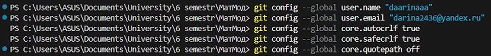{#fig:001 width=70%}

## Выполнение лабораторной работы

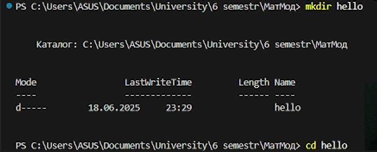{#fig:002 width=70%}

## Выполнение лабораторной работы

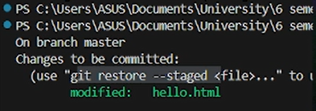{#fig:003 width=70%}

## Внесение изменений

Изменим содержимое файла hello.html на:

```
<h1>Hello, World!</h1>
```

## Выполнение лабораторной работы

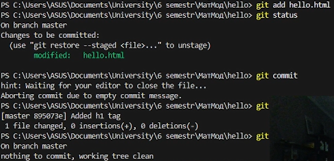{#fig:004 width=70%}

## Выполнение лабораторной работы

Изменим страницу «Hello, World», чтобы она содержала стандартные теги <html> и <body>.

```
<html>
  <body>
    <h1>Hello, World!</h1>
  </body>
</html>
```

## Выполнение лабораторной работы


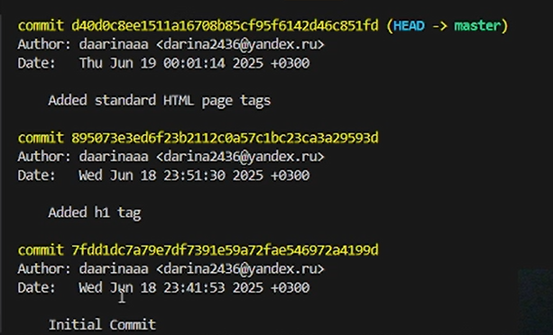{#fig:007 width=70%}

## Выполнение лабораторной работы
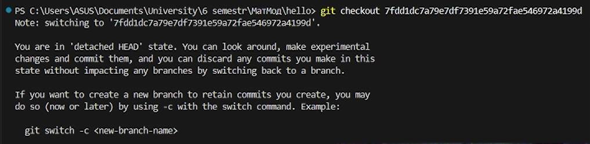{#fig:008 width=70%}

## Создание тегов версий

## Выполнение лабораторной работы
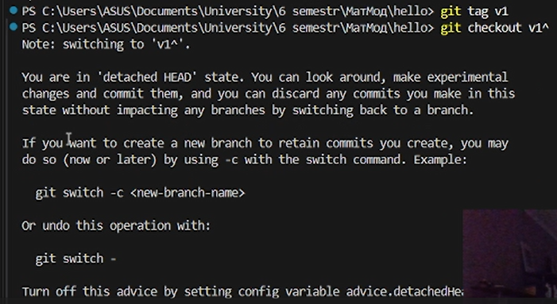{#fig:009 width=70%}

## Выполнение лабораторной работы

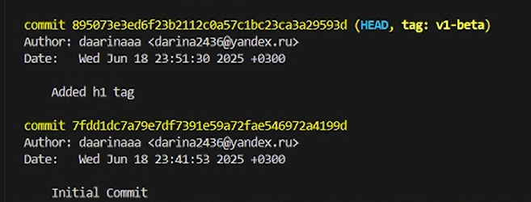{#fig:010 width=70%}


## Отмена локальных изменений (до индексации)

Убдеимся, что мы находимся на последнем коммите ветки master и внесем изменение в файл hello.html в виде нежелательного комментария.  Затем проверим статус, увидим, что изменения ещё не проиндексированы. Используем команду git checkout для переключения версии файла hello.html в репозитории(рис. @fig:011).

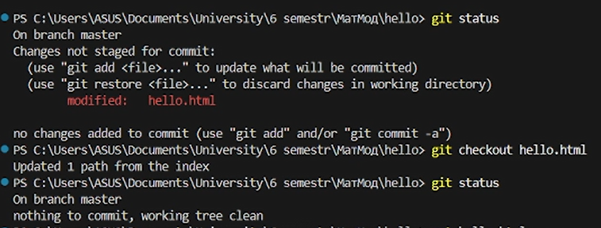{#fig:011 width=70%}

## Отмена проиндексированных изменений (перед коммитом)

Внесем изменение в файл hello.html в виде нежелательного комментария

```
<html>
  <head>
    <!-- This is an unwanted but staged comment -->
  </head>
  <body>
    <h1>Hello, World!</h1>
  </body>
</html>
```


## Выполнение лабораторной работы

Изменим файл hello.html на следующий.

```
<html>
  <head>
  </head>
  <body>
    <h1>Hello, World!</h1>
    <!-- This is an unwanted but committed change -->
  </body>
</html>
```

## Выполнение лабораторной работы
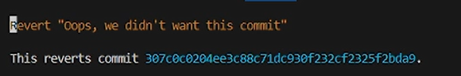{#fig:013 width=70%}

## Выполнение лабораторной работы
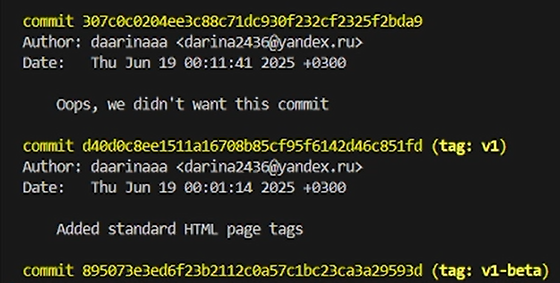{#fig:014 width=70%}


## Выполнение лабораторной работы
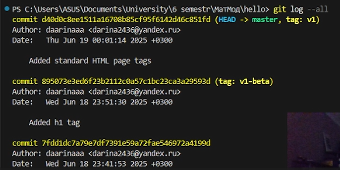{#fig:016 width=70%}

## Выполнение лабораторной работы

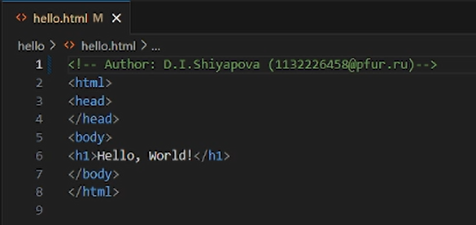{#fig:017 width=70%}


## Выполнение лабораторной работы

Добавим файл index.html в наш репозиторий

```
<html>
  <body>
    <iframe src="lib/hello.html" width="200" height="200" />
  </body>
</html>
```

## Выполнение лабораторной работы

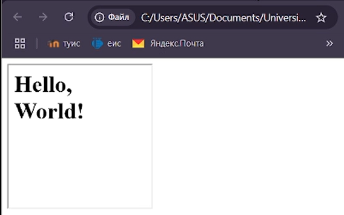{#fig:019 width=70%}

## Выполнение лабораторной работы

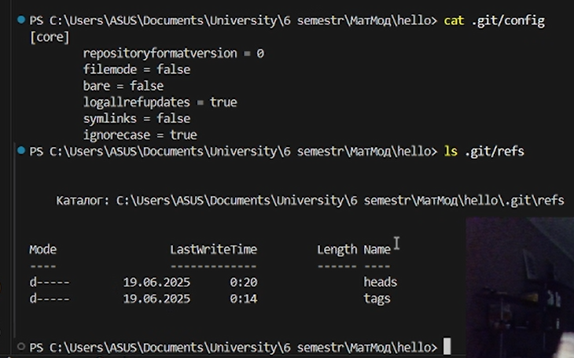{#fig:020 width=70%}

## Выполнение лабораторной работы

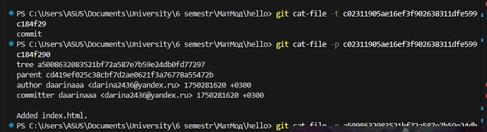{#fig:119 width=70%}


## Выполнение лабораторной работы

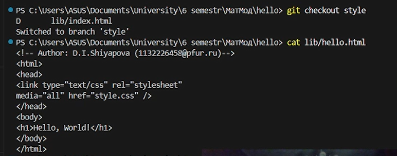{#fig:022 width=70%}

## Выполнение лабораторной работы
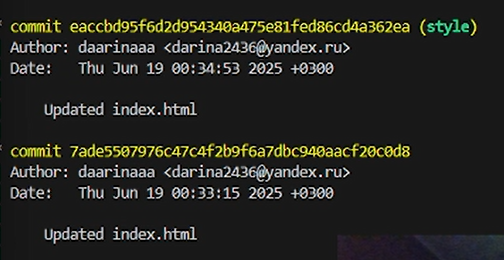{#fig:026 width=70%}

## Выполнение лабораторной работы

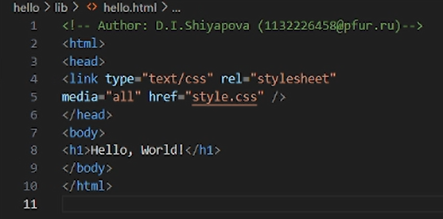{#fig:028 width=70%}

## Выполнение лабораторной работы
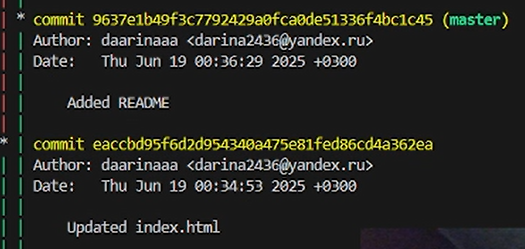{#fig:029 width=70%}

## Выполнение лабораторной работы
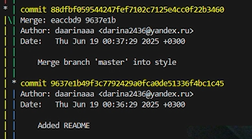{#fig:030 width=70%}

## Выполнение лабораторной работы
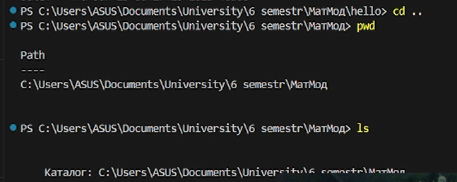{#fig:040 width=70%}

## Выполнение лабораторной работы

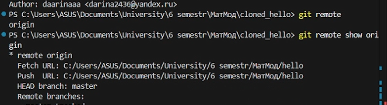{#fig:042 width=70%}

## Выполнение лабораторной работы

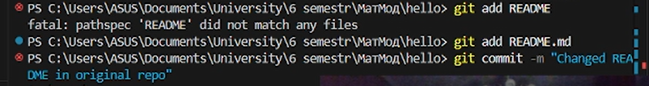{#fig:043 width=70%}

## Выполнение лабораторной работы
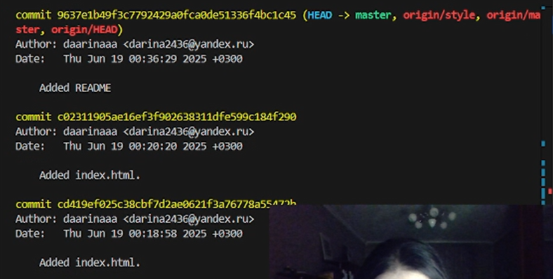{#fig:044 width=70%}

## Выполнение лабораторной работы

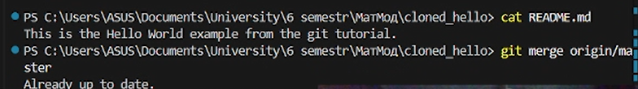{#fig:045 width=70%}

## Выполнение лабораторной работы
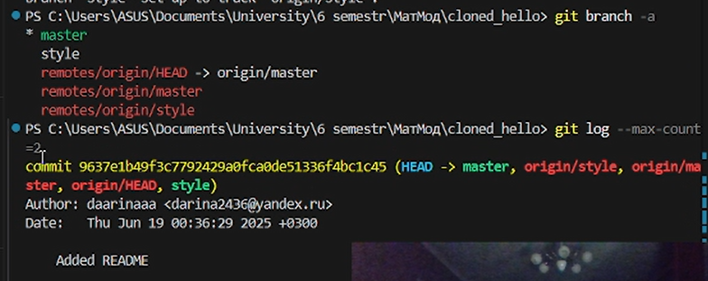{#fig:046 width=70%}

## Выполнение лабораторной работы.

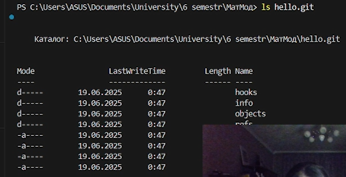{#fig:047 width=70%}

## Выполнение лабораторной работы

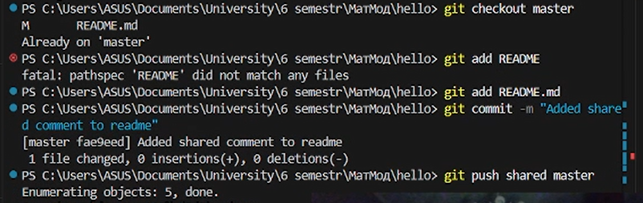{#fig:048 width=70%}

## Выводы

В процессе выполнения данной лабораторной работы я приобрела практические навыки работы с Git.


