---
## Front matter
lang: ru-RU
title: Лабораторная работа № 4
subtitle: Модель гармонических колебаний
author:
  - Шияпова Д.И.
institute:
  - Российский университет дружбы народов, Москва, Россия
date: 20 июня 2025

## i18n babel
babel-lang: russian
babel-otherlangs: english

## Formatting pdf
toc: false
toc-title: Содержание
slide_level: 2
aspectratio: 169
section-titles: true
theme: metropolis
header-includes:
 - \metroset{progressbar=frametitle,sectionpage=progressbar,numbering=fraction}
---

## Докладчик

:::::::::::::: {.columns align=center}
::: {.column width="70%"}

  * Шияпова Дарина Илдаровна
  * Студентка
  * Российский университет дружбы народов
  * [1132226458@pfur.ru](mailto:1132226458@pfur.ru)

:::
::: {.column width="30%"}

:::
::::::::::::::

## Цель работы

Построить математическую модель гармонического осциллятора.

## Задание

Построить фазовый портрет гармонического осциллятора и решение уравнения
гармонического осциллятора для следующих случаев:

1. Колебания гармонического осциллятора без затуханий и без действий внешней
силы
 $$\ddot{x} +18x = 0,$$

## Задание

2. Колебания гармонического осциллятора c затуханием и без действий внешней силы 
  
  $$\ddot x + 8 \dot x + 2 x = 0,$$

3. Колебания гармонического осциллятора c затуханием и под действием внешней силы 
   
   $$\ddot x + 3 \dot x + 7 x = 3 cos(7t).$$
На интервале $t \in [0; 73]$ (шаг 0.05) с начальными условиями $x_0 = 1.3, \,\, y_0= -0.3.$

## Теоретическое введение

Гармонические колебания — колебания, при которых физическая величина изменяется с течением времени по гармоническому (синусоидальному, косинусоидальному) закону.

Уравнение гармонического колебания имеет вид

$$x(t)=A\sin(\omega t+\varphi _{0})$$

или

$$x(t)=A\cos(\omega t+\varphi _{0}),$$ 

## Теоретическое введение

где $x$ — отклонение колеблющейся величины в текущий момент времени $t$ от среднего за период значения (например, в кинематике — смещение, отклонение колеблющейся точки от положения равновесия);
$A$ — амплитуда колебания, то есть максимальное за период отклонение колеблющейся величины от среднего за период значения, размерность 
$A$ совпадает с размерностью $x$;
$\omega$ (радиан/с, градус/с) — циклическая частота, показывающая, на сколько радиан (градусов) изменяется фаза колебания за 1 с;

## Теоретическое введение

$(\omega t+\varphi _{0})=\varphi$ (радиан, градус) — полная фаза колебания (сокращённо — фаза, не путать с начальной фазой);

$\varphi _{0}$ (радиан, градус) — начальная фаза колебаний, которая определяет значение полной фазы колебания (и самой величины $x$) в момент времени $t=0$.
Дифференциальное уравнение, описывающее гармонические колебания, имеет вид

$$\frac {d^{2}x}{dt^{2}}+\omega ^{2}x=0.$$

## Модель колебаний гармонического осциллятора без затуханий и без действий внешней силы

## Выполнение лабораторной работы
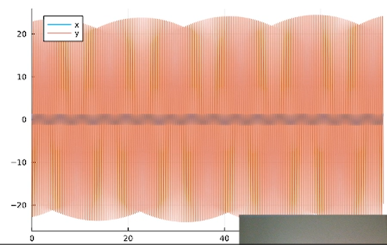{#fig:001 width=70%}
## Выполнение лабораторной работы
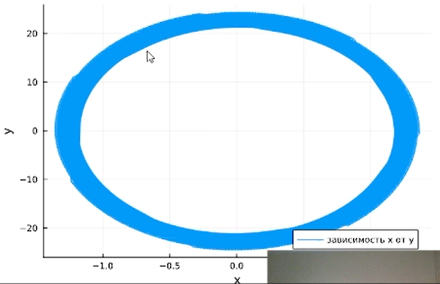{#fig:002 width=70%}

## Выполнение лабораторной работы

{#fig:003 width=70%}

## Выполнение лабораторной работы

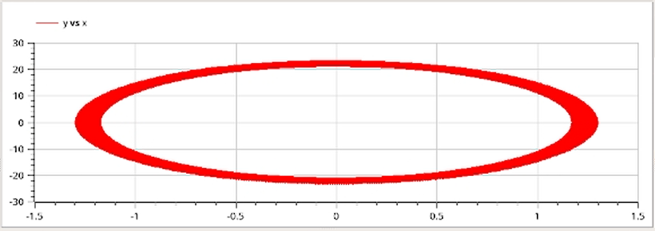{#fig:004 width=70%}

## Модель колебаний гармонического осциллятора c затуханием и без действий внешней силы 

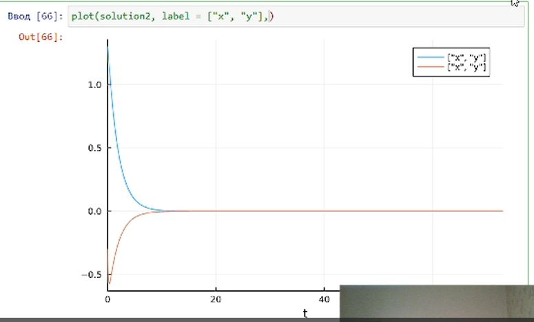{#fig:005 width=70%}

## Выполнение лабораторной работы

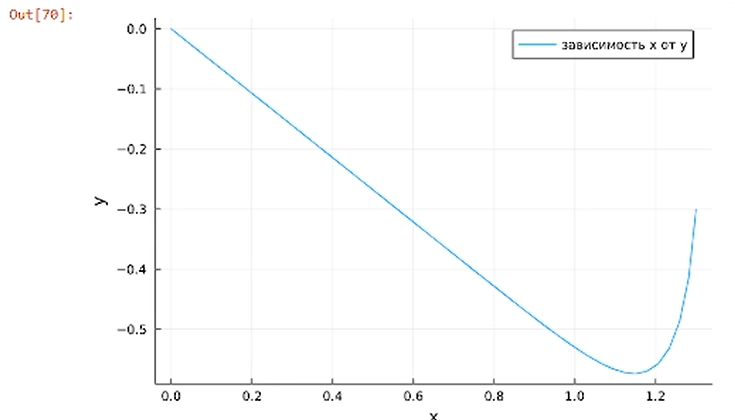{#fig:006 width=70%}

## Выполнение лабораторной работы

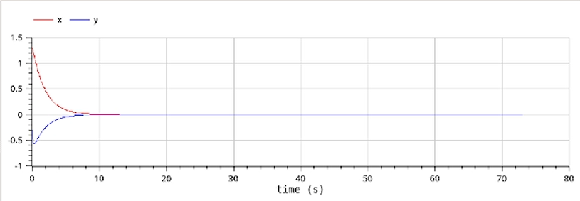{#fig:007 width=70%}

## Выполнение лабораторной работы

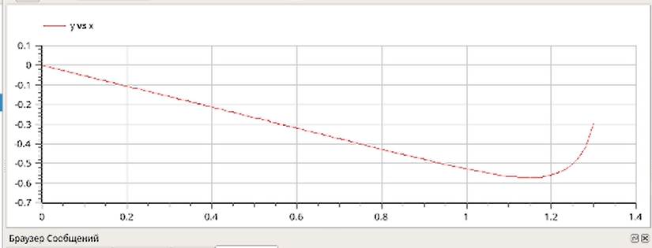{#fig:008 width=70%}

## Выполнение лабораторной работы

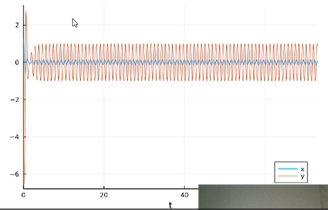{#fig:009 width=70%}

## Выполнение лабораторной работы

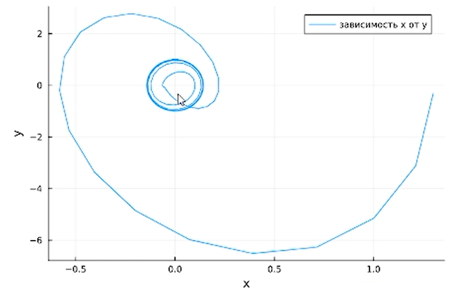{#fig:010 width=70%}

## Выполнение лабораторной работы

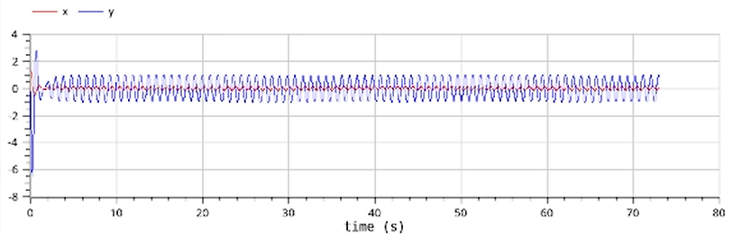{#fig:011 width=70%}

## Выполнение лабораторной работы

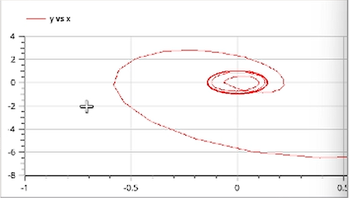{#fig:012 width=70%}

## Выводы

В процессе выполнения данной лабораторной работы я построила математическую модель гармонического осциллятора.

