---
## Front matter
title: "Лабораторная работа №4"
subtitle: "Модель гармонических колебаний"
author: "Шияпова Дарина Илдаровна"

## Generic otions
lang: ru-RU
toc-title: "Содержание"

## Bibliography
bibliography: bib/cite.bib
csl: pandoc/csl/gost-r-7-0-5-2008-numeric.csl

## Pdf output format
toc: true # Table of contents
toc-depth: 2
lof: true # List of figures
lot: false # List of tables
fontsize: 12pt
linestretch: 1.5
papersize: a4
documentclass: scrreprt
## I18n polyglossia
polyglossia-lang:
  name: russian
  options:
	- spelling=modern
	- babelshorthands=true
polyglossia-otherlangs:
  name: english
## I18n babel
babel-lang: russian
babel-otherlangs: english
## Fonts
mainfont: PT Serif
romanfont: PT Serif
sansfont: PT Sans
monofont: PT Mono
mainfontoptions: Ligatures=TeX
romanfontoptions: Ligatures=TeX
sansfontoptions: Ligatures=TeX,Scale=MatchLowercase
monofontoptions: Scale=MatchLowercase,Scale=0.9
## Biblatex
biblatex: true
biblio-style: "gost-numeric"
biblatexoptions:
  - parentracker=true
  - backend=biber
  - hyperref=auto
  - language=auto
  - autolang=other*
  - citestyle=gost-numeric
## Pandoc-crossref LaTeX customization
figureTitle: "Рис."
tableTitle: "Таблица"
listingTitle: "Листинг"
lofTitle: "Список иллюстраций"
lotTitle: "Список таблиц"
lolTitle: "Листинги"
## Misc options
indent: true
header-includes:
  - \usepackage{indentfirst}
  - \usepackage{float} # keep figures where there are in the text
  - \floatplacement{figure}{H} # keep figures where there are in the text
---

# Цель работы

Построить математическую модель гармонического осциллятора.

# Задание

Построить фазовый портрет гармонического осциллятора и решение уравнения
гармонического осциллятора для следующих случаев:

1. Колебания гармонического осциллятора без затуханий и без действий внешней
силы
 $$\ddot{x} +18x = 0,$$

2. Колебания гармонического осциллятора c затуханием и без действий внешней силы 
  
  $$\ddot x + 8 \dot x + 2 x = 0,$$

3. Колебания гармонического осциллятора c затуханием и под действием внешней силы 
   
   $$\ddot x + 3 \dot x + 7 x = 3 cos(7t).$$
На интервале $t \in [0; 73]$ (шаг 0.05) с начальными условиями $x_0 = 1.3, \,\, y_0= -0.3.$

# Теоретическое введение

Гармонические колебания — колебания, при которых физическая величина изменяется с течением времени по гармоническому (синусоидальному, косинусоидальному) закону.

Уравнение гармонического колебания имеет вид

$$x(t)=A\sin(\omega t+\varphi _{0})$$

или

$$x(t)=A\cos(\omega t+\varphi _{0}),$$ 

где $x$ — отклонение колеблющейся величины в текущий момент времени $t$ от среднего за период значения (например, в кинематике — смещение, отклонение колеблющейся точки от положения равновесия);
$A$ — амплитуда колебания, то есть максимальное за период отклонение колеблющейся величины от среднего за период значения, размерность 
$A$ совпадает с размерностью $x$;
$\omega$ (радиан/с, градус/с) — циклическая частота, показывающая, на сколько радиан (градусов) изменяется фаза колебания за 1 с;

$(\omega t+\varphi _{0})=\varphi$ (радиан, градус) — полная фаза колебания (сокращённо — фаза, не путать с начальной фазой);

$\varphi _{0}$ (радиан, градус) — начальная фаза колебаний, которая определяет значение полной фазы колебания (и самой величины $x$) в момент времени $t=0$.
Дифференциальное уравнение, описывающее гармонические колебания, имеет вид

$$\frac {d^{2}x}{dt^{2}}+\omega ^{2}x=0.$$

[@wiki_bash].

# Выполнение лабораторной работы

## Модель колебаний гармонического осциллятора без затуханий и без действий внешней силы

Для начала реализуем эту модель на языке программирования Julia. 

```Julia

# Используемые библиотеки
using DifferentialEquations, Plots;

# Начальные условия
tspan = (0,73)
u0 = [1.3, -0.3]
p1 = [0, 18]

# Задание функции
function f1(u, p, t)
    x, y = u
    g, w = p
    dx = y
    dy = -g .*y - w^2 .*x
    return [dx, dy]
end

# Постановка проблемы и ее решение
problem1 = ODEProblem(f1, u0, tspan, p1)
sol1 = solve(problem1, Tsit5(), saveat = 0.05)
```

В результате получаем следующие графики решения уравнения
гармонического осциллятора  (рис. [-@fig:001]) и его фазового портрета  (рис. [-@fig:002]).

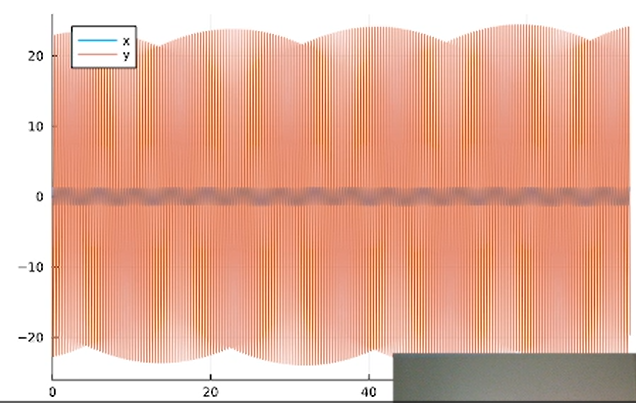{#fig:001 width=70%}

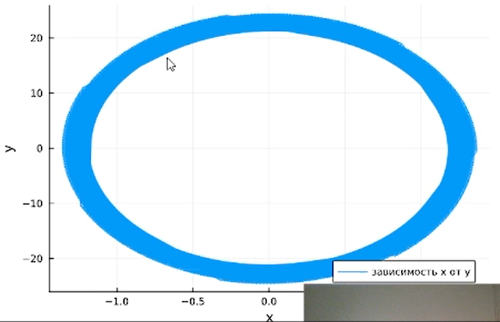{#fig:002 width=70%}

Можно заметить, что колебание осциллятора периодично, график не задухает.

Теперь реализуем эту модель посредством OpenModelica.

```
model lab4_1
  parameter Real g = 0;
  parameter Real w = 18;
  parameter Real x0 = 1.3;
  parameter Real y0 = -0.3;
  Real x(start=x0);
  Real y(start=y0);
equation
    der(x) = y;
    der(y) = -g .*y - w^2 .*x;
end lab4_1;
```

В результате получаем следующие графики решения уравнения гармонического осциллятора  (рис. [-@fig:003]) и его фазового портрета  (рис. [-@fig:004]).

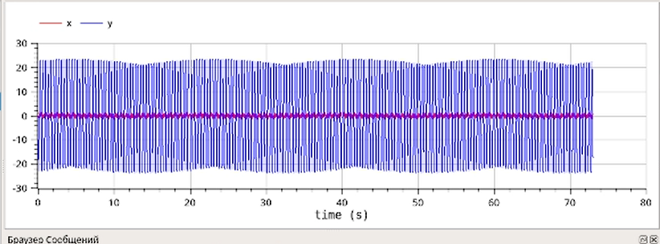{#fig:003 width=70%}

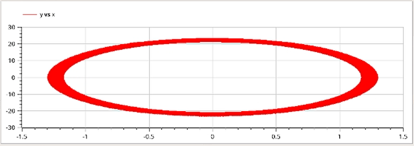{#fig:004 width=70%}

Также несложно увидеть, что графики, полученные с помощью OpenModelica и Julia идентичны.

## Модель колебаний гармонического осциллятора c затуханием и без действий внешней силы 

Реализуем эту модель на языке программирования Julia. 

```Julia

# Используемые библиотеки
using DifferentialEquations, Plots;

# Начальные условия
tspan = (0,73)
u0 = [1.3, -0.3]
p2 = [8, 2]

# Задание функции
function f1(u, p, t)
    x, y = u
    g, w = p
    dx = y
    dy = -g .*y - w^2 .*x
    return [dx, dy]
end

# Постановка проблемы и ее решение
problem2 = ODEProblem(f1, u0, tspan, p2)
sol2 = solve(problem2, Tsit5(), saveat = 0.05)
```

В результате получаем следующие графики решения уравнения
гармонического осциллятора  (рис. [-@fig:005]) и его фазового портрета  (рис. [-@fig:006]).

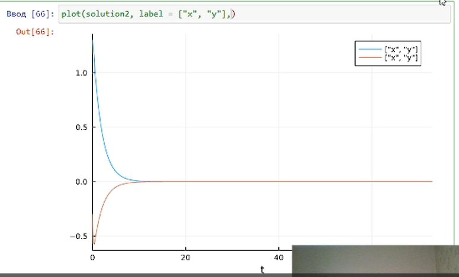{#fig:005 width=70%}

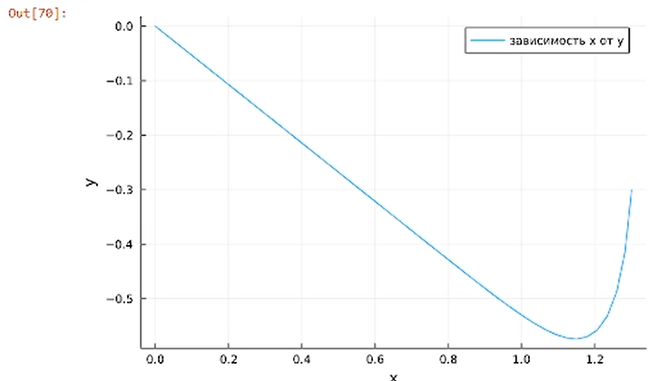{#fig:006 width=70%}

В этом случае сначала происходят колебания осциллятора, а затем график затухает, поскольку у нас есть параметр, отвечающий за потери энергии.

Теперь реализуем эту модель посредством OpenModelica.

```
model lab4_2
  parameter Real g = 8;
  parameter Real w = 2;
  parameter Real x0 = 1.3;
  parameter Real y0 = -0.3;
  Real x(start=x0);
  Real y(start=y0);
equation
    der(x) = y;
    der(y) = -g .*y - w^2 .*x;
end lab4_2;

```

В результате получаем следующие графики решения уравнения
гармонического осциллятора  (рис. [-@fig:007]) и его фазового портрета  (рис. [-@fig:008]).

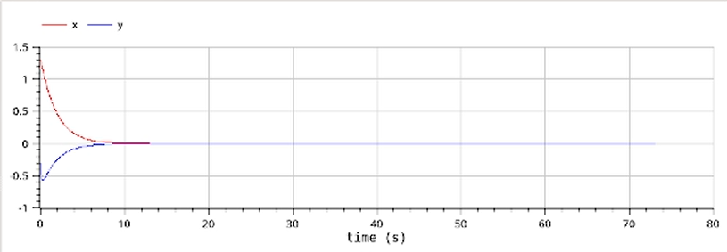{#fig:007 width=70%}

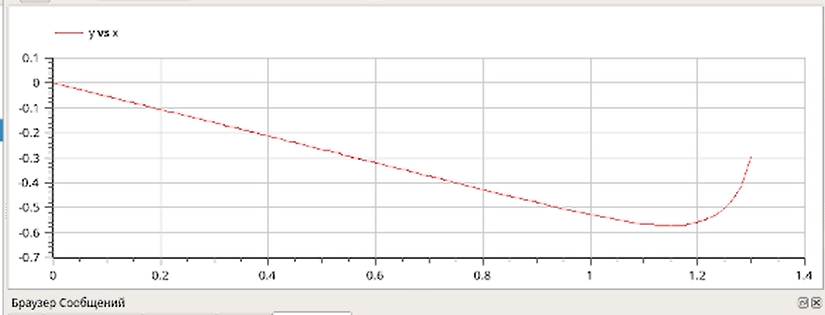{#fig:008 width=70%}

Во второй модели также несложно увидеть, что графики, полученные с помощью OpenModelica и Julia идентичны.

## Модель колебаний гармонического осциллятора c затуханием и под действием внешней силы

Реализуем эту модель на языке программирования Julia. 

```Julia

# Используемые библиотеки
using DifferentialEquations, Plots;

# Начальные условия
tspan = (0,73)
u0 = [1.3, -0.3]
p3 = [3, 7]

# Функция, описывающая внешние силы, действующие на осциллятор
f(t) = 3*sin(7*t)

# Задание функции
function f2(u, p, t)
    x, y = u
    g, w = p
    dx = y
    dy = -g .*y - w^2 .*x .+f(t)
    return [dx, dy]
end

# Постановка проблемы и ее решение
problem3 = ODEProblem(f2, u0, tspan, p3)
sol3 = solve(problem3, Tsit5(), saveat = 0.05)
```

В результате получаем следующие графики решения уравнения
гармонического осциллятора  (рис. [-@fig:009]) и его фазового портрета  (рис. [-@fig:010]).

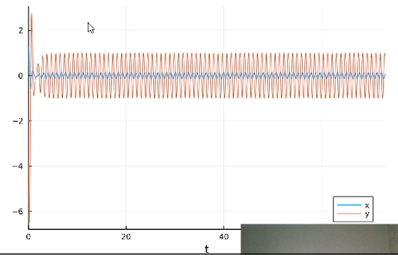{#fig:009 width=70%}

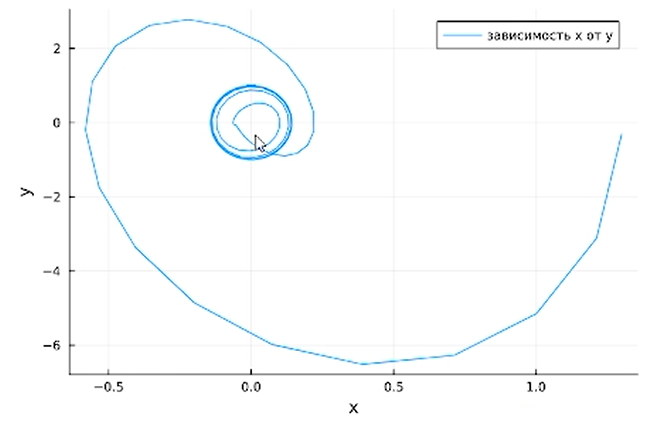{#fig:010 width=70%}

Теперь реализуем эту модель посредством OpenModelica.

```
model lab4_3
  parameter Real g = 3;
  parameter Real w = 7;
  parameter Real x0 = 1.3;
  parameter Real y0 = -0.3;
  Real x(start=x0);
  Real y(start=y0);
equation
    der(x) = y;
    der(y) = -g .*y - w^2 .*x + 3*sin(7*time);
end lab4_3;
```

В результате получаем следующие графики решения уравнения
гармонического осциллятора  (рис. [-@fig:011]) и его фазового портрета  (рис. [-@fig:012]).

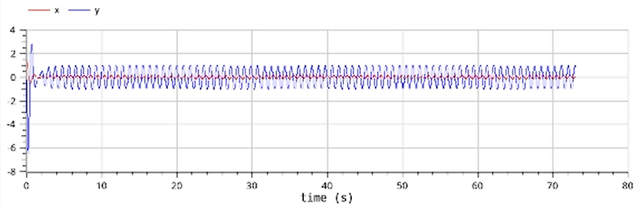{#fig:011 width=70%}

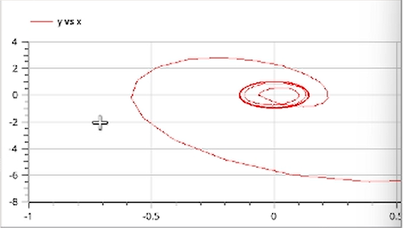{#fig:012 width=70%}

В третьем случае графики, полученные с помощью OpenModelica и Julia все также идентичны.

# Выводы

В процессе выполнения данной лабораторной работы я построила математическую модель гармонического осциллятора.

# Список литературы{.unnumbered}

::: {#refs}
:::
