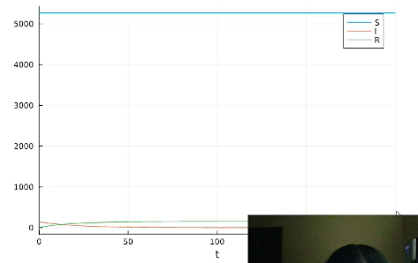
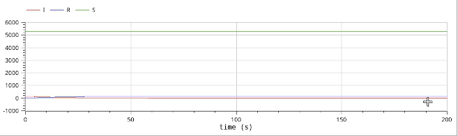
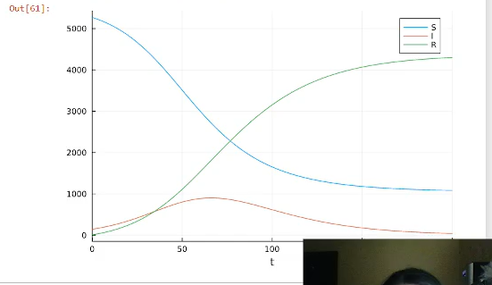
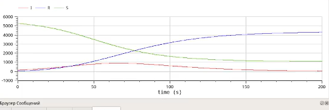

---
## Front matter
lang: ru-RU
title: Лабораторная работа № 6
subtitle: Задача об эпидемии
author:
  - Шияпова Д.И.
institute:
  - Российский университет дружбы народов, Москва, Россия
date: 05 апреля 2025

## i18n babel
babel-lang: russian
babel-otherlangs: english

## Formatting pdf
toc: false
toc-title: Содержание
slide_level: 2
aspectratio: 169
section-titles: true
theme: metropolis
header-includes:
 - \metroset{progressbar=frametitle,sectionpage=progressbar,numbering=fraction}
---

## Докладчик

:::::::::::::: {.columns align=center}
::: {.column width="70%"}

  * Шияпова Дарина Илдаровна
  * Студентка
  * Российский университет дружбы народов
  * [1132226458@pfur.ru](mailto:1132226458@pfur.ru)

:::
::: {.column width="30%"}

:::
::::::::::::::

## Цель работы

Исследовать модель SIR (задача об эпидемии)

## Задание

На одном острове вспыхнула эпидемия. Известно, что из всех проживающих
на острове ($N=5424$) в момент начала эпидемии ($t=0$) число заболевших людей
(являющихся распространителями инфекции) $I(0)=145$, А число здоровых людей с
иммунитетом к болезни $R(0)=9$. Таким образом, число людей восприимчивых к
болезни, но пока здоровых, в начальный момент времени $S(0)=N-I(0)- R(0)$.

## Задание

Постройте графики изменения числа особей в каждой из трех групп.

Рассмотрите, как будет протекать эпидемия в случае:
1) если $I(0)\leq I^*$;
2) если $I(0) > I^*$.

## Теоретическое введение

Компартментальные модели являются очень общим методом моделирования. Они часто применяются к математическому моделированию инфекционных заболеваний. Население распределяется по отделениям с помощью меток – например, S, I, или R, (Susceptible, Infectious, or Recovered). Люди могут прогресс между отсеками. Порядок расположения меток обычно показывает структуру потоков между компартментами; например, SEIS означает восприимчивый, подверженный воздействию, инфекционный, затем снова восприимчивый.

## Теоретическое введение

Зарождение таких моделей относится к началу 20 века, важными работами которого являются работы Росса в 1916 году Росс и Хадсон в 1917 году, Кермак и Маккендрик в 1927 г., и Кендалл в 1956 году. Модель Рид–Мороз также был важным и широко упускаемым из виду предком современных подходов к эпидемиологическому моделированию.

## Теоретическое введение

Модели чаще всего управляются с помощью обыкновенных дифференциальных уравнений (которые являются детерминированными), но также могут использоваться со стохастической (случайной) структурой, которая более реалистична, но гораздо сложнее в анализе.

Модели пытаются предсказать такие вещи, как распространение болезни, или общее число инфицированных, или продолжительность эпидемии, а также оценить различные эпидемиологические параметры, такие как репродуктивное число. Такие модели могут показать, насколько различаются вмешательства общественного здравоохранения могут повлиять на исход эпидемии, например, на то, какой метод является наиболее эффективным для выпуска ограниченного количества вакцин в данной популяции.

##Выполнение лабораторной работы

Рассмотрим случай, когда число заболевших не превышает критического значения $I^*$, то есть считаем, что все больные изолированы и не заражают здоровых.
{#fig:001 width=70%}

##Выполнение лабораторной работы

{#fig:002 width=70%}

##Выполнение лабораторной работы

Рассмотрим случай, когда число заболевших превышает критическое значения $I^*$, то есть считаем, что инфицирование способны заражать восприимчивых к болезни особей. 
{#fig:003 width=70%}

##Выполнение лабораторной работы

{#fig:004 width=70%}

## Выводы

В результате выполнения данной лабораторной работы я исследовала модель SIR.
