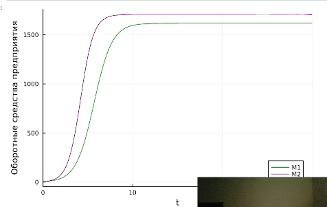
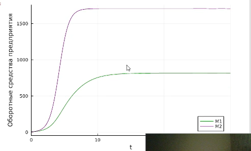
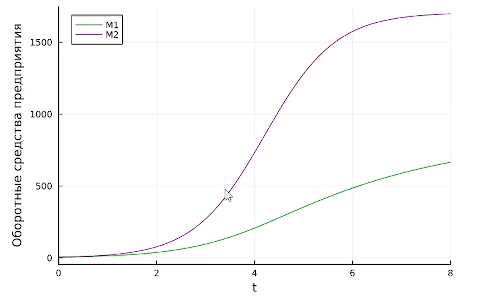
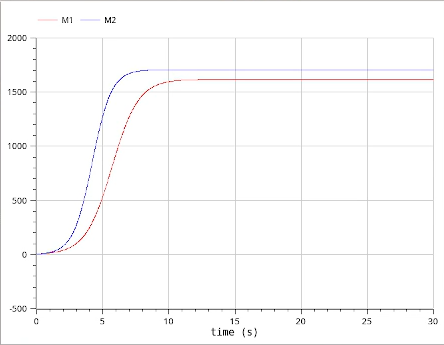
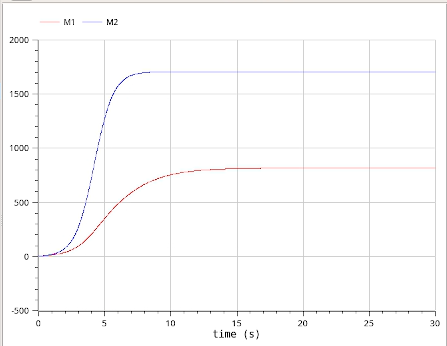
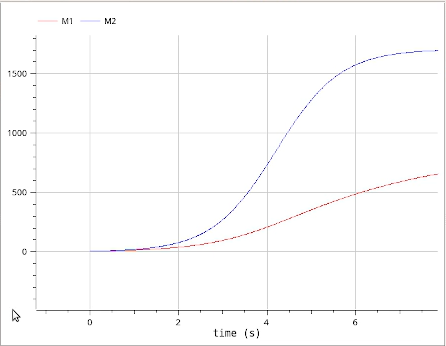

---
## Front matter
lang: ru-RU
title: Лабораторная работа № 8
subtitle: Модель конкуренции двух фирм
author:
  - Шияпова Д.И.
institute:
  - Российский университет дружбы народов, Москва, Россия
date: 20 июня 2025

## i18n babel
babel-lang: russian
babel-otherlangs: english

## Formatting pdf
toc: false
toc-title: Содержание
slide_level: 2
aspectratio: 169
section-titles: true
theme: metropolis
header-includes:
 - \metroset{progressbar=frametitle,sectionpage=progressbar,numbering=fraction}
---

## Докладчик

:::::::::::::: {.columns align=center}
::: {.column width="70%"}

  * Шияпова Дарина Илдаровна
  * Студентка
  * Российский университет дружбы народов
  * [1132226458@pfur.ru](mailto:1132226458@pfur.ru)

:::
::: {.column width="30%"}

:::
::::::::::::::

## Цель работы

Исследовать математическую модель конкуренции двух фирм.

## Задание

Случай 1.

Рассмотрим две фирмы, производящие взаимозаменяемые товары
одинакового качества и находящиеся в одной рыночной нише. Считаем, что в рамках
нашей модели конкурентная борьба ведётся только рыночными методами. То есть, конкуренты могут влиять на противника путем изменения параметров своего
производства: себестоимость, время цикла, но не могут прямо вмешиваться в
ситуацию на рынке («назначать» цену или влиять на потребителей каким-либо иным способом.) Будем считать, что постоянные издержки пренебрежимо малы, и в
модели учитывать не будем. 
## Задание

Случай 2.

Рассмотрим модель, когда, помимо экономического фактора
влияния (изменение себестоимости, производственного цикла, использование
кредита и т.п.), используются еще и социально-психологические факторы –
формирование общественного предпочтения одного товара другому, не зависимо от
их качества и цены. В этом случае взаимодействие двух фирм будет зависеть друг
от друга, соответственно коэффициент перед $M_1M_2$
будет отличаться. Пусть в
рамках рассматриваемой модели динамика изменения объемов продаж фирмы 1 и
фирмы 2 описывается следующей системой уравнений:

## Задание

1. Построить графики изменения оборотных средств фирмы 1 и фирмы 2 без
учета постоянных издержек и с веденной нормировкой для случая 1.
2. Построить графики изменения оборотных средств фирмы 1 и фирмы 2 без
учета постоянных издержек и с веденной нормировкой для случая 2.

## Теоретическое введение

Математическому моделированию процессов конкуренции и сотрудничества двух фирм на различных рынках посвящено довольно много научных работ, в основном использующих аппарат теории игр и статистических решений. В качестве примера можно привести работы таких исследователей, как Курно, Стакельберг, Бертран, Нэш, Парето [@model].

Следует отметить, что динамические дифференциальные модели уже давно и успешно используются для математического моделирования самых разнообразных по своей природе процессов. Достаточно упомянуть широко использующуюся в экологии модель «хищник-жертва» Вольтерра, математическую теорию развития эпидемий, модели боевых действий

## Теоретическое введение

Задача решалась в следующей постановке.

На рынке однородного товара присутствуют две основные фирмы, разделяющие его между собой, т.е. имеет место классическая дуополия.

Безусловно, это является весьма сильным предположением, однако оно вполне оправдано в тех случаях, когда доля продаж остальных конкурентов на рассматриваемом сегменте рынке пренебрежимо мала. Хорошим примером может служить отечественный рынок микропроцессоров, который по существу разделили между собой две фирмы: Intel и AMD. 

## Теоретическое введение

Изменение объемов продаж конкурирующих фирм с течением времени описывается следующей системой дифференциальных уравнений:

$$\begin{cases}
\frac{d M_1}{d \theta} = M_1 - \dfrac{b}{c_1} M_1 M_2 - \dfrac{a_1}{c_1} M_1^2,\\
\frac{d M_2}{d \theta} = \dfrac{c_2}{c_1} M_1 - \dfrac{b}{c_1} M_1 M_2 - \dfrac{a_2}{c_1} M_2^2,
\end{cases}$$

где $a_1 = \dfrac{p_{cr}}{(\tau _1^2 \tilde{p_1} N q)}$, $a_2 = \dfrac{p_{cr}}{(\tau _2 ^2*\tilde{p_2} N q)}$, $b = \dfrac{p_{cr}}{(\tau _1^2 \tau _2^2 \tilde{p_1}^2 \tilde{p_2}^2 N q)}$,
$c_1 = \dfrac{(p_{cr}-p_1)}{(\tau _1 \tilde{p_1})}$, $c_2 = \dfrac{(p_{cr}-p_2)}{(\tau _2 \tilde{p_2})}$.

## Теоретическое введение

- $N$ -- число потребителей производимого продукта.
- $\tau$ -- длительность производственного цикла
- $p$ -- рыночная цена товара
- $\tilde p$ -- себестоимость продукта, то есть переменные издержки на производство единицы продукции.
- $q$ -- максимальная потребность одного человека в продукте в единицу времени 
- $\theta = \dfrac{t}{c_1}$ -- безразмерное время

## Выполнение лабораторной работы

{#fig:001 width=70%}

## Выполнение лабораторной работы

{#fig:002 width=70%}

## Выполнение лабораторной работы

{#fig:003 width=70%}

## Выполнение лабораторной работы

{#fig:004 width=70%}

## Выполнение лабораторной работы

{#fig:005 width=70%}

## Выполнение лабораторной работы

{#fig:006 width=70%}

## Выводы

В результате выполнения лабораторной работы была исследована модель конкуренции двух фирм.
